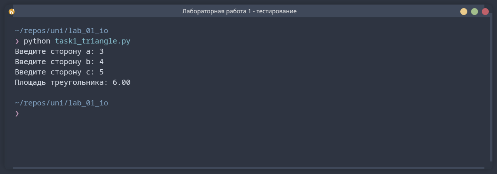
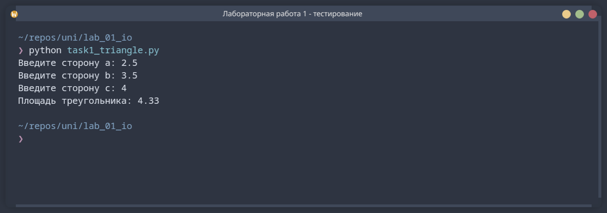
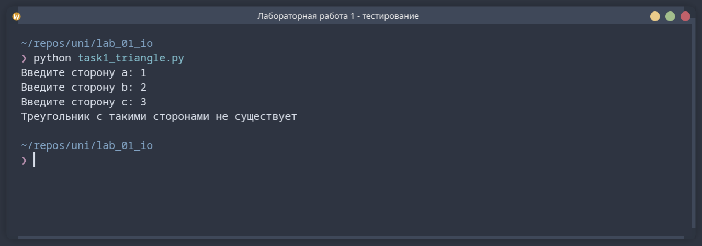
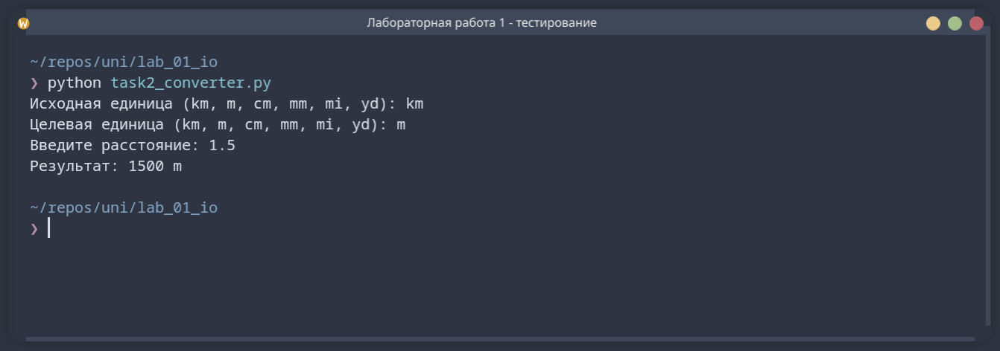
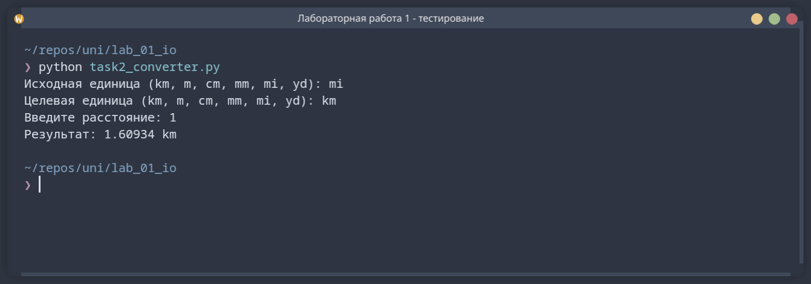
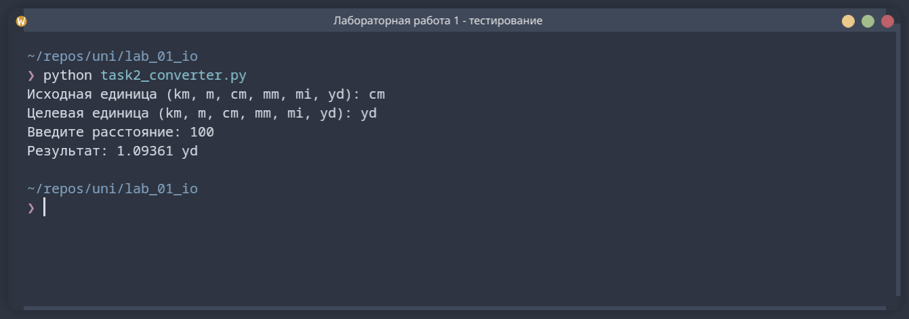
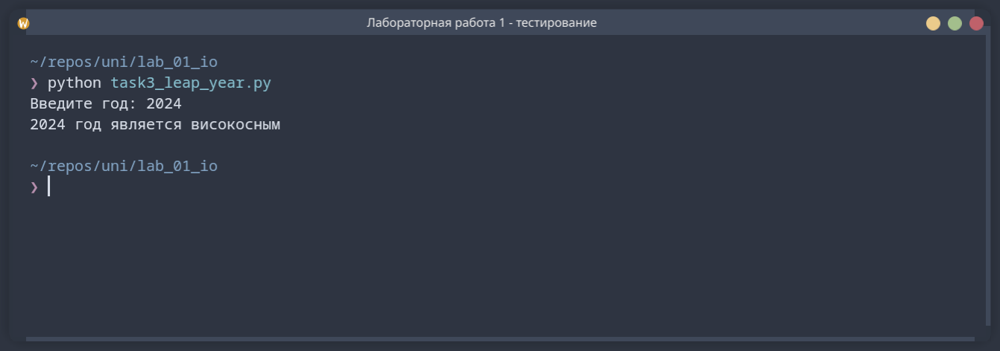
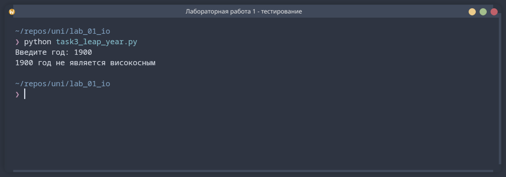
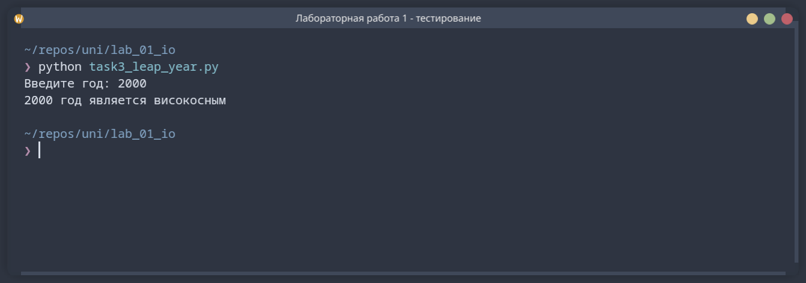

# Лабораторная работа № 01

## Исполнитель

**GrandfatherTECH**

## Тема работы

Операторы ввода/вывода. Условный оператор.

## Задания

В репозитории находятся три самостоятельных проекта на языке Python.

### Задание 1.1 — калькулятор площади треугольника

Написать программу, которая принимает длины трёх сторон треугольника,
вычисляет его площадь по формуле Герона и выводит результат с точностью до
сотых. Вводимые числа могут быть целыми или дробными.

Проект дополнительно проверяет, может ли существовать треугольник с указанными
сторонами.

### Задание 1.2 — конвертер единиц измерения расстояния

Создать программу, которая переводит расстояние из одной единицы измерения в
другую. Поддерживаются километры (`km`), метры (`m`), сантиметры (`cm`),
миллиметры (`mm`), мили (`mi`) и ярды (`yd`). Пользователь выбирает исходную и
целевую единицы, а затем вводит значение для преобразования.

### Задание 1.3 — определение високосного года

Написать программу, которая определяет, является ли введённый год високосным.
Год является високосным, если делится на 400 либо делится на 4, но не делится
на 100. Для выбора результата используются условные операторы.

## Структура репозитория

```text
oop-shenanigans/
├── task1_triangle/
│   ├── main.py
│   └── screenshots/
├── task2_converter/
│   ├── main.py
│   └── screenshots/
├── task3_leap_year/
│   ├── main.py
│   └── screenshots/
└── README.md
```

Каждая папка `task...` является отдельным проектом.

## Среда программирования

Для работы необходим **Python 3.10 или новее**. Сторонние библиотеки не нужны.

Проекты можно открыть в **PyCharm**, **Visual Studio Code**, **IDLE** или другой
среде с поддержкой Python. В выбранной среде следует открыть папку нужного
проекта, а затем файл `main.py`.

## Запуск программ

Откройте терминал в корневой папке репозитория и выполните одну из команд:

```bash
python task1_triangle/main.py
python task2_converter/main.py
python task3_leap_year/main.py
```

Если команда `python` не найдена, используйте `python3`:

```bash
python3 task1_triangle/main.py
```

После запуска программа последовательно выводит подсказки. Необходимо вводить
значения с клавиатуры и подтверждать каждый ввод клавишей `Enter`.

Для первой программы вводятся три стороны треугольника. Для второй — обозначения
исходной и целевой единиц, затем расстояние. Для третьей — целый год.

## Тестирование

Все приведённые ниже тесты выполнены реальным запуском программ в терминале
KiTTY.

### Задание 1.1

#### Тест 1 — прямоугольный треугольник со сторонами 3, 4 и 5



#### Тест 2 — треугольник с дробными длинами сторон



#### Тест 3 — вырожденный треугольник



### Задание 1.2

#### Тест 1 — перевод 1,5 километра в метры



#### Тест 2 — перевод одной мили в километры



#### Тест 3 — перевод 100 сантиметров в ярды



### Задание 1.3

#### Тест 1 — 2024 год



#### Тест 2 — 1900 год



#### Тест 3 — 2000 год


